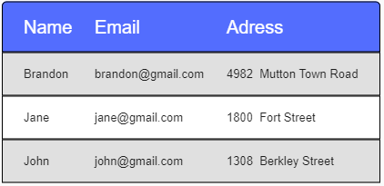

# custom_datatable

A Flutter package that allows customization of the datatable by modifying the colors

## Getting Started

This project is a starting point for a Dart
[package](https://flutter.dev/developing-packages/),
a library module containing code that can be shared easily across
multiple Flutter or Dart projects.

For help getting started with Flutter, view our 
[online documentation](https://flutter.dev/docs), which offers tutorials, 
samples, guidance on mobile development, and a full API reference.


### Example

```dart
import 'package:example/widgets/custom_datatable.dart';
import 'package:flutter/material.dart';

void main() {
  runApp(MyApp());
}

class MyApp extends StatelessWidget {
  @override
  Widget build(BuildContext context) {
  TextStyle headerTextStyle =TextStyle(color:Colors.white,fontSize:20);
    return MaterialApp(
      title: 'Custom Datatable example',
      theme: ThemeData(
        primarySwatch: Colors.blue,
        visualDensity: VisualDensity.adaptivePlatformDensity,
      ),
      debugShowCheckedModeBanner: false,
      home: Scaffold(
        body: 
          Center(
            child: 
              CustomDataTable(
                dataTable: DataTable(
                   columns: [DataColumn(label: Text("Name",style: headerTextStyle,),),DataColumn(label: Text("Email",style: headerTextStyle,),),DataColumn(label: Text("Adress",style: headerTextStyle,),),], 
                  rows: [
                    DataRow(cells: [DataCell(Text("Brandon")),DataCell(Text("brandon@gmail.com")),DataCell(Text("4982  Mutton Town Road"))]),
                    DataRow(cells: [DataCell(Text("Jane")),DataCell(Text("jane@gmail.com")),DataCell(Text("1800  Fort Street")),]),
                    DataRow(cells: [DataCell(Text("John"),),DataCell(Text("john@gmail.com"),),DataCell(Text("1308  Berkley Street"),),]),
                  ]
                ),
                rowColor1:Colors.grey.shade300,
                headerColor: Colors.green,
              )
          )          
      )
    );
  }
}
```

